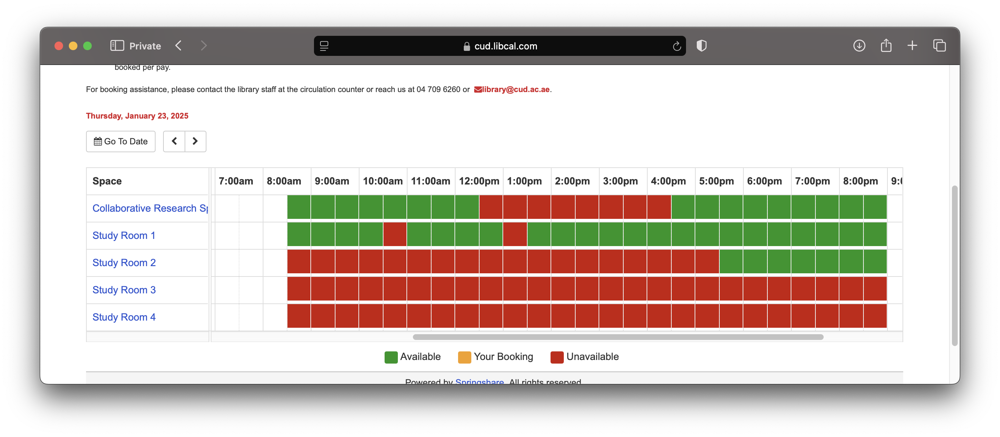
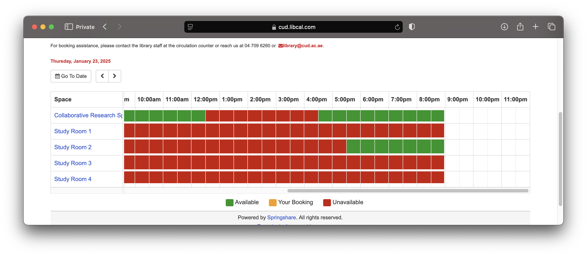

# Interactive Library Room Reservation for CUD HUB Campus

Welcome to the Interactive Library Room Reservation project for CUD HUB Campus!

This project allows you to reserve library rooms interactively based on the internal API of CUD HUB's reservation system.

## Overview

So far, the functionality provided is basic, allowing users to interact with the library reservation system (accessible via [CUD HUB Campus Reservation](https://cud.libcal.com/reserve)) and make room reservations.

### How it Works

This project works by sniffing the internal API of the CUD HUB reservation system to provide automated interaction with the library's room reservation platform.

This is how the reservation system looks like before the reservation spam:

Logs form the reservation spam:
```text
[...]
Cancel link: https://cud.libcal.com/equipment/cancel?id=cs_jwMn8AsK
2025-01-23 17:30:00 - 2025-01-23 18:00:00 booked on email 65eeag29t0@students.cud.ac.ae
Cancel link: https://cud.libcal.com/equipment/cancel?id=cs_lo7VmwHj
2025-01-23 18:00:00 - 2025-01-23 18:30:00 booked on email 4b3g76ayz0@students.cud.ac.ae
Cancel link: https://cud.libcal.com/equipment/cancel?id=cs_jwMnJJsK
2025-01-23 18:30:00 - 2025-01-23 19:00:00 booked on email i9xnri4hz2@students.cud.ac.ae
[...]
```

This is how the reservation system looks like after the reservation spam:


## Features

- Interactive room reservation through CUD HUB Campus library system.
- Based on internal API sniffing, allowing for efficient interaction with the backend.
- Simple and clean Python code (everything you need is in the [interactive_booking.py](examples/interactive_booking.py) file).

## Usage

To use the interactive mode, follow these steps:

1. Navigate to the `examples/[interactive_booking.py](examples/interactive_booking.py)` file in your project directory.
2. Run the script by executing:
   ```bash
   python examples/interactive_booking.py
   ```
3. Once the script is running, choose your preferred mode (interactive or another option) when prompted.
4. Follow the on-screen instructions to reserve a library room.

Make sure you have all required dependencies installed before running the script. If needed, you can install them by running:
```bash
pip install -r pyCUDLib/requirements.txt
```

---

Let me know if you need any more information! 
[Telegram](https://t.me/pythonist42)


### Requirements

- Python 3.x
- Additional libraries: [aiohttp]

## Notes

This is an early-stage example project. The functionality is basic and intended for use in understanding how the reservation system can be interacted with programmatically. Improvements and enhancements will be made over time.

Feel free to contribute by submitting pull requests or reporting issues!

